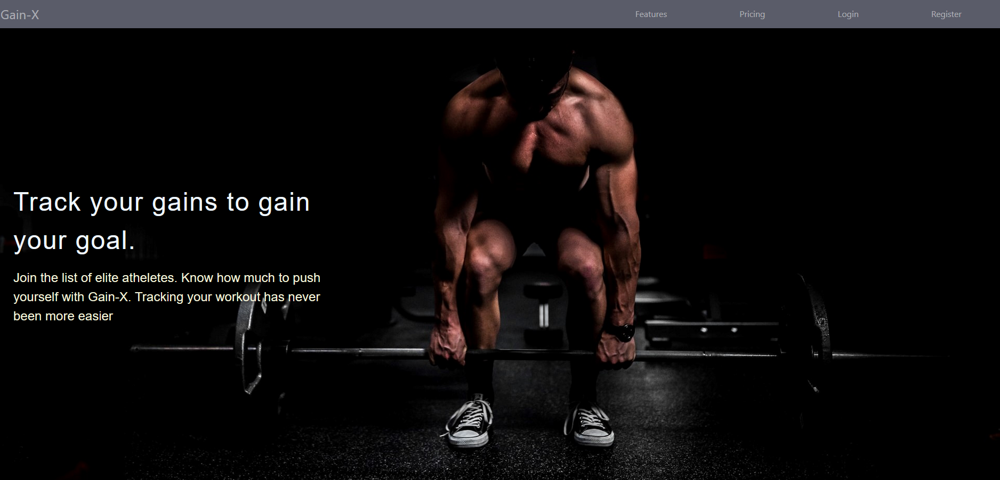

# This is a fitness logger website based on MERN stack

Backend of the website is hosted at [Fitness Logger Backend](https://github.com/anusu90/fitness-logger-backend)

## SCREENSHOT

## Available Features

1. Log your daily weight and get a good looking graph of your progress. Whether you are bulking or cutting this can be useful.
2. Log your exercises and see your best performance, so that you know how much to push
3. Get a list of all your exercises.
